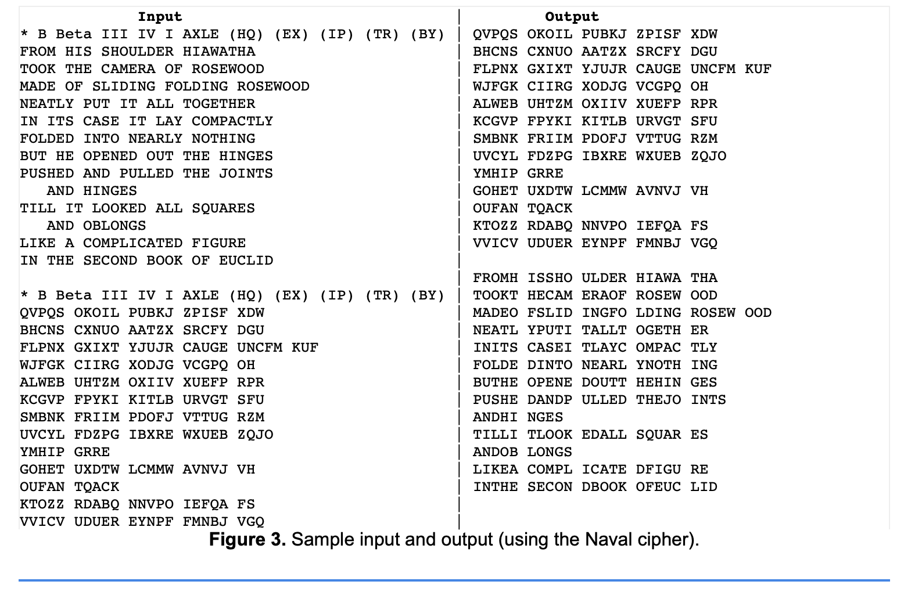

# Enigma

A reimplementation of the Enigma Machine that Germany used in WWII to encrypt its military communications. 
The project utilizes some data structures such as Hashmap, ArrayList, in order to implement most of the Enigma machine's feature.

Visualization of how Enigma encryption works (with the German Navy version)
[Screenshot for this project](./EnigmaCode.png)
 

